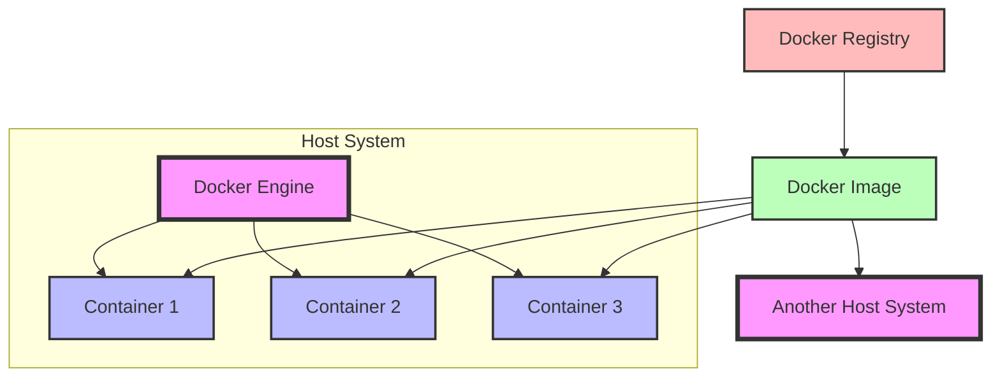

# Docker

Owner: Andrés Carrancá
Tags: Process

# What is Docker?

Docker is a platform that simplifies the process of creating, deploying, and running applications by using containers.

## Key Concepts:

- **Containers:** Lightweight, standalone packages that include everything needed to run an application (code, runtime, system tools, libraries, and settings).
- **Images:** Templates used to create containers. They contain the application code, libraries, and dependencies.
- **Docker Engine:** The core technology that runs and manages containers.

## Benefits of Docker:

- **Consistency:** Ensures applications run the same way across different environments.
- **Isolation:** Containers run independently, reducing conflicts between applications.
- **Portability:** Easy to move and deploy applications across different systems.
- **Efficiency:** Lightweight nature allows for better resource utilization compared to traditional virtual machines.

In simple terms, Docker allows developers to package an application with all its dependencies into a standardized unit (container) for easy deployment and scaling.

## Docker Architecture Diagram

Here's a visual representation of how Docker works, emphasizing container portability:



This diagram illustrates:

- The Docker Engine running on a host system, managing multiple containers.
- Containers (1, 2, 3) created from a single Docker Image, showing how one image can spawn multiple identical environments.
- The Docker Registry, from which images can be pulled.
- Another host system, demonstrating that the same image can be used to create identical containers on different machines, ensuring portability.

The key to Docker's portability is that containers include all necessary dependencies, making them consistent across different environments. This "build once, run anywhere" principle is what makes Docker containers so easily portable and deployable across various systems.

## Installing Docker

### Windows Installation Steps:

1. Download Docker Desktop for Windows from the official Docker website.
2. Double-click the installer to run it.
3. Follow the installation wizard, accepting the default settings.
4. Once installed, start Docker Desktop.
5. Wait for Docker to start and display the whale icon in the system tray.
6. Open a command prompt and run `docker --version` to verify the installation.

### Linux Installation Steps (Ubuntu):

1. Update your package index: `sudo apt-get update`
2. Install prerequisites: `sudo apt-get install apt-transport-https ca-certificates curl software-properties-common`
3. Add Docker's official GPG key: `curl -fsSL https://download.docker.com/linux/ubuntu/gpg | sudo apt-key add -`
4. Add the Docker repository: `sudo add-apt-repository "deb [arch=amd64] https://download.docker.com/linux/ubuntu $(lsb_release -cs) stable"`
5. Update the package index again: `sudo apt-get update`
6. Install Docker: `sudo apt-get install docker-ce`
7. Verify the installation: `sudo docker run hello-world`

Note: The Linux installation steps may vary depending on the specific distribution. These steps are for Ubuntu.

## What is a Dockerfile?

A Dockerfile is a text file that contains instructions for building a Docker image. It specifies the base image, environment, files, and commands needed to create a container.

### Simple Dockerfile Example:

```
# Use an official Python runtime as the base image
FROM python:3.9-slim

# Set the working directory in the container
WORKDIR /app

# Copy the current directory contents into the container
COPY . /app

# Install any needed packages specified in requirements.txt
RUN pip install --no-cache-dir -r requirements.txt

# Make port 80 available to the world outside this container
EXPOSE 80

# Run app.py when the container launches
CMD ["python", "app.py"]
```

This Dockerfile creates an image for a simple Python application, installing dependencies and setting up the environment.

## Docker and Visual Studio Code

Visual Studio Code (VSC) provides excellent support for Docker development through its Docker extension. This integration enhances the Docker development experience within the IDE.

### Key Features:

- **Docker Explorer:** Easily manage Docker images, containers, and volumes directly from VSC.
- **Dockerfile and docker-compose.yml support:** Syntax highlighting, autocompletion, and linting for Docker files.
- **IntelliSense:** Context-aware autocompletion for Dockerfile commands.
- **Container debugging:** Debug applications running inside containers.

### Setting up Docker in VSC:

1. Install the Docker extension from the VSC marketplace.
2. Ensure Docker is installed and running on your system.
3. Open a project with a Dockerfile or docker-compose.yml file.
4. Use the Docker Explorer sidebar to manage Docker resources.

### Common Tasks:

- **Build an image:** Right-click on a Dockerfile and select "Build Image".
- **Run a container:** Right-click on an image in the Docker Explorer and choose "Run".
- **View logs:** Right-click on a running container and select "View Logs".
- **Attach shell:** Right-click on a running container and choose "Attach Shell".

Using Docker with VSC streamlines the development workflow, making it easier to build, test, and debug containerized applications directly from your IDE.

## Common Docker Commands

### Creating and Removing Images

- **Build an image:** `docker build -t myimage:tag .`
Example: `docker build -t myapp:v1 .`
- **Remove an image:** `docker rmi image_name:tag`
Example: `docker rmi myapp:v1`

### Creating and Removing Containers

- **Create and run a container:** `docker run --name mycontainer image_name:tag`
Example: `docker run --name mywebapp nginx:latest`
- **Remove a container:** `docker rm container_name`
Example: `docker rm mywebapp`

### Working with Ports, Volumes, and Interactive Mode

- **Map ports:** `docker run -p host_port:container_port image_name`
Example: `docker run -p 8080:80 nginx`
- **Mount a volume:** `docker run -v /host/path:/container/path image_name`
Example: `docker run -v /home/user/data:/app/data myapp:v1`
- **Run in interactive mode:** `docker run -it image_name /bin/bash`
Example: `docker run -it ubuntu /bin/bash`

These commands cover the basics of creating and managing Docker images and containers, as well as working with ports, volumes, and interactive mode. Remember to replace `image_name`, `tag`, and `container_name` with your specific values when using these commands.

##